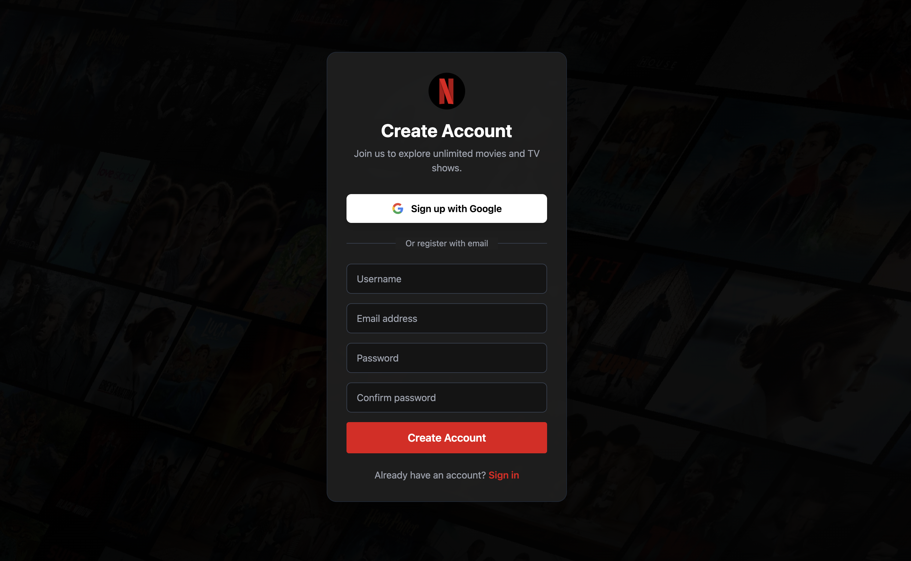
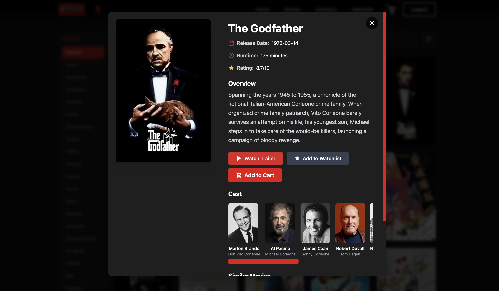

# Netflix Movie Explorer

**Netflix Movie Explorer** is a modern, responsive Vue 3 application that provides a comprehensive movie discovery and management platform. Built with Vue 3, Tailwind CSS, and Firebase, it offers real-time movie data powered by The Movie Database (TMDB) API.

---

## Author

Developed by [Ao Tian](https://github.com/ao-tian)

---

## Features

### Authentication & User Management
- **User Registration & Login**: Secure authentication with email/password and Google Sign-In
- **Session Management**: Persistent login state across browser sessions

### Movie Discovery
- **Real-time Search**: Instant movie search with autocomplete suggestions
- **Popular Movies**: Default display of trending and popular movies
- **Genre Browsing**: Sidebar navigation with 20+ movie genres
- **Advanced Filtering**: Filter movies by release year (This Year, Last Year, Even Earlier)
- **Pagination**: Navigate through search results with smooth page transitions

### Movie Details
- **Comprehensive Information**: View detailed movie information including ratings, release dates, runtime, and overviews
- **Movie Trailers**: Watch embedded YouTube trailers directly in the application
- **Cast & Crew**: Browse top cast members with photos and character names
- **Similar Movies**: Discover related movies with clickable recommendations
- **Interactive Modals**: Beautiful, responsive modal interfaces for movie details

### Shopping Cart & Inventory
- **Shopping Cart**: Add movies to cart for purchase
- **Purchase System**: Complete purchases to move movies to your inventory
- **Inventory Management**: View all purchased movies in your personal inventory
- **Duplicate Prevention**: System prevents purchasing movies already in inventory
- **Permanent Deletion**: Remove movies from inventory with confirmation dialogs

### Watchlist
- **Personal Watchlist**: Save movies you want to watch later
- **Easy Management**: Add or remove movies from watchlist with one click
- **Dedicated Page**: Access your watchlist from the navigation menu

### Mock Watch Player
- **Watch Progress Tracking**: Track your viewing progress for movies in inventory
- **Mock Player Interface**: Beautiful player interface with play/pause controls
- **Progress Visualization**: Visual progress bars showing completion percentage
- **Continue Watching**: Resume watching from where you left off
- **Time Tracking**: Display minutes watched and total runtime

### User Interface
- **Modern Design**: Netflix-inspired UI with Tailwind CSS
- **Responsive Layout**: Fully responsive design for desktop, tablet, and mobile devices
- **Smooth Animations**: Elegant transitions and hover effects throughout
- **Dark Theme**: Eye-friendly dark theme optimized for movie browsing
- **Custom Scrollbars**: Styled scrollbars matching the application theme

---

## Screenshots

### Homepage
The landing page features a modern design with animated backgrounds and clear call-to-action sections.


### Registration & Login
Secure authentication interface supporting both email/password and Google Sign-In options.



### Movie Search & Discovery
Advanced search interface with autocomplete, genre sidebar, and filtering options. Browse popular movies or search for specific titles.


### Movie Details
Comprehensive movie information modal featuring trailers, cast information, similar movies, and interactive controls for cart, watchlist, and inventory management.



---

## Technology Stack

- **Frontend Framework**: Vue 3 (Composition API)
- **Build Tool**: Vite
- **Styling**: Tailwind CSS
- **State Management**: Pinia
- **Routing**: Vue Router
- **Authentication**: Firebase Authentication
- **Database**: Firebase Firestore
- **API**: The Movie Database (TMDB) API
- **Deployment**: Firebase Hosting

---

## Local Setup Instructions

### Prerequisites
- Node.js (v16 or higher)
- npm or yarn package manager

### Installation Steps

1. **Install Node.js**
   
   Download and install Node.js from [nodejs.org](https://nodejs.org/)
   
   Verify the installation:
   ```bash
   node -v
   npm -v
   ```

2. **Clone the Repository**
   ```bash
   git clone https://github.com/ao-tian/Netflix-Movie-Explorer.git
   cd Netflix-Movie-Explorer-main
   ```

3. **Install Dependencies**
   ```bash
   npm install
   ```

4. **Configure Firebase**
   
   Create a Firebase project and add your configuration to `src/firebase/index.js`:
   - Firebase Authentication (Email/Password and Google Sign-In)
   - Firebase Firestore
   - Firebase Hosting (optional, for deployment)

5. **Run Development Server**
   ```bash
   npm run dev
   ```

6. **Access the Application**
   
   Open your browser and visit the local development URL (typically `http://localhost:5173`)

### Build for Production
```bash
npm run build
```

---

## Project Structure

```
Netflix-Movie-Explorer-main/
├── src/
│   ├── components/          # Vue components
│   │   ├── Header.vue      # Navigation header
│   │   ├── Hero.vue        # Homepage hero section
│   │   ├── Movie.vue       # Movie browsing page
│   │   ├── Modal.vue       # Movie details modal
│   │   ├── cart.vue        # Shopping cart
│   │   ├── Inventory.vue   # User inventory
│   │   └── Watchlist.vue   # User watchlist
│   ├── views/              # Page views
│   │   ├── homeview.vue    # Homepage view
│   │   ├── Loginhome.vue   # Dashboard for logged-in users
│   │   ├── Login.vue       # Login page
│   │   ├── Register.vue   # Registration page
│   │   ├── Inventory.vue  # Inventory page view
│   │   └── Watchlist.vue  # Watchlist page view
│   ├── store/              # Pinia store
│   │   └── index.js        # Global state management
│   ├── router/             # Vue Router
│   │   └── index.js        # Route definitions
│   ├── firebase/           # Firebase configuration
│   │   └── index.js        # Firebase initialization
│   └── assets/            # Static assets
│       └── main.css       # Tailwind CSS imports
├── image/                  # Screenshot images
├── public/                 # Public assets
└── package.json           # Dependencies and scripts
```

---

## Key Features Implementation

### State Management
The application uses Pinia for centralized state management, tracking:
- Movie data and search results
- Shopping cart items
- User inventory
- Watchlist items
- Watch progress for each movie

### API Integration
- **TMDB API**: Fetches movie data, trailers, cast information, and similar movies
- **Firebase Authentication**: Handles user registration and login
- **Firebase Firestore**: Stores user-specific data (optional, currently using in-memory state)

### Responsive Design
- Mobile-first approach with Tailwind CSS
- Breakpoints optimized for various screen sizes
- Touch-friendly interface elements
- Adaptive layouts for different devices

---

## Disclaimer

This project is intended solely for **educational and portfolio purposes**. It is not affiliated with, endorsed by, or connected to Netflix, TMDB, or any other third-party film data providers.

All logos, images, and brand references belong to their respective copyright holders. No copyrighted material is hosted or distributed through this project.

### Why This Project Is Not Publicly Deployed

This application interacts with third-party APIs and may display copyrighted movie content such as titles, images, and metadata. To avoid any potential copyright infringement or violations of third-party API terms of service, the project has **not been deployed to a public domain**.

If you wish to run the project locally, you are welcome to clone the repository and run it for personal use.

---

## License

This project is for educational purposes only. Please respect the terms of service of all third-party APIs and services used in this application.

---

## Acknowledgments

- **The Movie Database (TMDB)**: For providing comprehensive movie data API
- **Vue.js Team**: For the excellent Vue 3 framework
- **Tailwind CSS**: For the utility-first CSS framework
- **Firebase**: For authentication and hosting services
